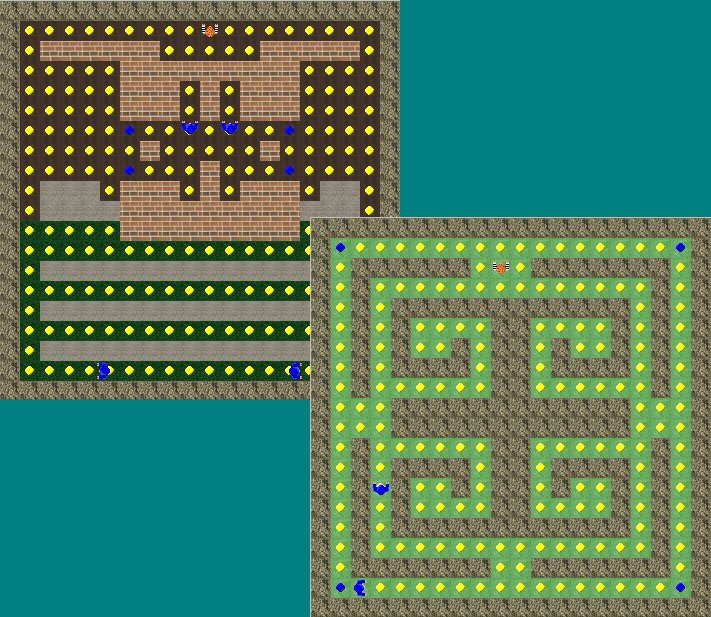



## CoinCollector

### Description

This is a pacman type game, you are a thief that has to steal all the money while avoiding the guards. The game uses BitBlt and comes with a mapeditor and about 30 maps. Please leave a comment to tell me what you think of it.
 
### More Info
 

             |
---                |---
**Submitted On**   |2002-01-06 18:22:40
**By**             |[Dennis Meelker](https://github.com/Planet-Source-Code/PSCIndex/blob/master/ByAuthor/dennis-meelker.md)
**Level**          |Intermediate
**User Rating**    |4.2 (21 globes from 5 users)
**Compatibility**  |VB 5\.0, VB 6\.0
**Category**       |[Games](https://github.com/Planet-Source-Code/PSCIndex/blob/master/ByCategory/games__1-38.md)
**World**          |[Visual Basic](https://github.com/Planet-Source-Code/PSCIndex/blob/master/ByWorld/visual-basic.md)
**Archive File**   |[CoinCollec552962142002\.zip](https://github.com/Planet-Source-Code/dennis-meelker-coincollector__1-31800/archive/master.zip)

